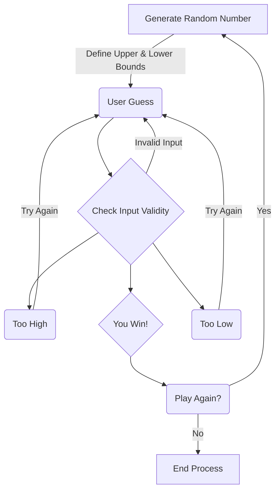

The process begins by generating a random number between defined upper and lower limits. The user then inputs their guess. The user input is first checked to ensure valid format and range. If invalid the user will guess again. If valid the user's guess is checked against the random number. If the number is too high or too low the user guesses again. If the number is correct the user wins. The user is then prompted with the choice to play again. If they answer affirmatively the process will restart and a new number will be generated. If the user declines the process is terminated.